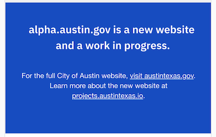

# Blue footer

## Name:

### Blue footer (WIP)

## Design (Desktop):

## Design (Mobile):

## Resident facing implementation (Desktop):

## Resident facing implementation (Mobile):

## Resident facing implementation (Code):

Janis (js) - [components/PageSections/Footer/index.js](https://github.com/cityofaustin/janis/blob/master/src/components/PageSections/Footer/index.js)

## Copy _I recommend changing this to a rich text field in Joplin_:

### In Janis:

- City Seal
  - [components/SVGs/CitySeal.js](https://github.com/cityofaustin/janis/blob/master/src/components/SVGs/CitySeal.js)
- "Work in progress"
  - There's a lot going on to make this work in [components/WorkInProgress/index.js](https://github.com/cityofaustin/janis/blob/master/src/components/WorkInProgress/index.js)
- "for the full site visit"
  - [definitions.js](https://github.com/cityofaustin/janis/blob/ec7a30a7c066d59c325f8822db30e098f16e09a8/src/js/i18n/definitions.js#L57)
  - [en.json](https://github.com/cityofaustin/janis/blob/ec7a30a7c066d59c325f8822db30e098f16e09a8/src/js/i18n/locales/en.json#L37)
  - [es.json](https://github.com/cityofaustin/janis/blob/ec7a30a7c066d59c325f8822db30e098f16e09a8/src/js/i18n/locales/es.json#L39)
  - ar.json - _missing_
  - vi.json - _missing_
