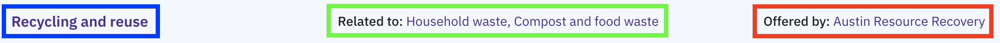

# Contextual nav menu

## Name:

### Contextual nav menu (WIP)

## Picture

## Logic

### Back (blue part)

Based on the URL, it will show the direct parent. For service/info/guide pages it'll show the topic or department. For topic pages it'll show the topic collection.

### Related to (green part)

- On a service/info/guide page:
  - It will show all sibling topics of the direct parent of the page (if the URL is the topic kind as opposed to the department kind)
- On a topic page:
  - It will show sibling topics of this page

### Offered by (red part)

This will show all departments the page is "offered by" (set by setting "related departments" in joplin)

## Janis implementation (code)

[components/PageSections/ContextualNav/index.js](https://github.com/cityofaustin/janis/blob/master/src/components/PageSections/ContextualNav/index.js)
