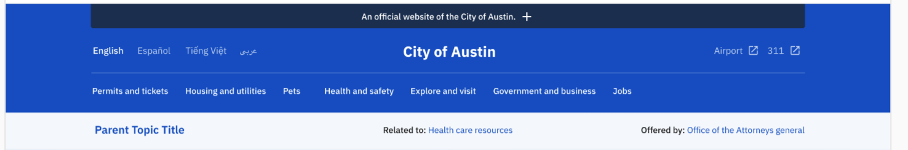
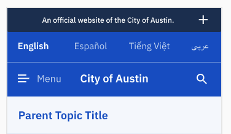
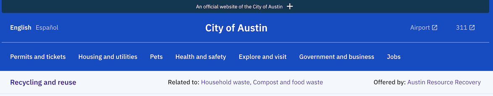
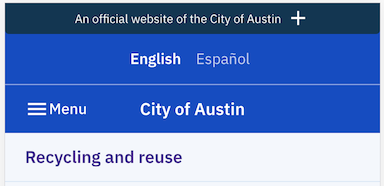

# Header

## Name:

### Header (WIP)

## Design (desktop)

## Design (mobile)

## Resident facing implementation (desktop):

## Resident facing implementation (mobile):

## Copy Table
|  | Current Location | Proposed future location |
| --- | --- | --- |
| Official website header | [Janis](https://github.com/cityofaustin/alpha-documentation/blob/master/official_website_header.md#copy) | New "Header" model in Joplin |
| Header language selection | [Janis](https://github.com/cityofaustin/alpha-documentation/blob/master/header_language_selection.md#resident-facing-implementation-code) | Joplin (maybe supported langs endpoint?) |
| Site title | Hardcoded in [Janis component](https://github.com/cityofaustin/alpha-documentation/blob/master/site_title.md#copy) | Joplin "Header" model |
| External Links | [Janis](https://github.com/cityofaustin/alpha-documentation/blob/master/header_external_links.md#copy) | Joplin "Header" model |
| Navigation Menu | Joplin [Themes/Topic Collections](https://github.com/cityofaustin/alpha-documentation/blob/master/navigation_menu.md#copy) | 👍 |
| Contextual Nav Menu | Custom logic with Joplin/Janis | Ideally built into page objects |

## Subcomponents

- [Official website header](official_website_header.md) (Name WIP)
- [Header language selection](header_language_selection.md) (Name WIP)
- [Site title](site_title.md) (Name WIP)
- [Header external links](header_external_links.md) (Name WIP)
- [Navigation Menu](navigation_menu.md) (Name WIP)
- [Contextual Nav menu](contextual_nav_menu.md) (Name WIP)
