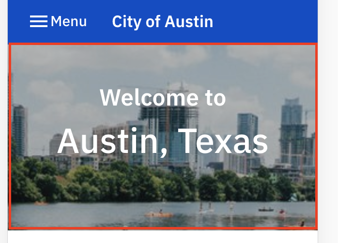

# Homepage banner

## Name:

### Homepage banner (WIP)

## Resident facing implementation (Desktop):

## Resident facing implementation (Mobile):

## Resident facing implementation (Code):

[components/HeroHome/index.js](https://github.com/cityofaustin/janis/blob/master/src/components/HeroHome/index.js)

## Copy:

### Banner image

This lives in production Joplin, and the image is retrieved in Janis using hardcoded data in [static.config.js](https://github.com/cityofaustin/janis/blob/ec7a30a7c066d59c325f8822db30e098f16e09a8/static.config.js#L71)

### Banner text

#### In Janis

Preheader ("Welcome To"):

- [definitions.js](https://github.com/cityofaustin/janis/blob/ec7a30a7c066d59c325f8822db30e098f16e09a8/src/js/i18n/definitions.js#L62)
- [en.json](https://github.com/cityofaustin/janis/blob/ec7a30a7c066d59c325f8822db30e098f16e09a8/src/js/i18n/locales/en.json#L32)
- [es.json](https://github.com/cityofaustin/janis/blob/ec7a30a7c066d59c325f8822db30e098f16e09a8/src/js/i18n/locales/es.json#L33)
- [ar.json](https://github.com/cityofaustin/janis/blob/ec7a30a7c066d59c325f8822db30e098f16e09a8/src/js/i18n/locales/ar.json#L32)
- [vi.json](https://github.com/cityofaustin/janis/blob/ec7a30a7c066d59c325f8822db30e098f16e09a8/src/js/i18n/locales/vi.json#L32)

"Austin, Texas" - hardcoded into the [HeroHome component](https://github.com/cityofaustin/janis/blob/ec7a30a7c066d59c325f8822db30e098f16e09a8/src/components/HeroHome/index.js#L18)
