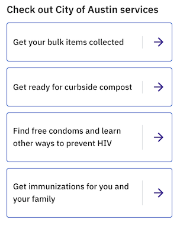

# Homepage top services

## Name:

### Homepage top services (WIP)

## Resident facing implementation (Desktop):

## Resident facing implementation (Mobile):

## Resident facing implementation (Code):

[components/Tiles/TopServices.js](https://github.com/cityofaustin/janis/blob/master/src/components/Tiles/TopServices.js)

## Copy:

### Title ("Check out City of Austin services")

#### In Janis

- [definitions.js](https://github.com/cityofaustin/janis/blob/ec7a30a7c066d59c325f8822db30e098f16e09a8/src/js/i18n/definitions.js#L62)
- [en.json](https://github.com/cityofaustin/janis/blob/ec7a30a7c066d59c325f8822db30e098f16e09a8/src/js/i18n/locales/en.json#L32)
- [es.json](https://github.com/cityofaustin/janis/blob/ec7a30a7c066d59c325f8822db30e098f16e09a8/src/js/i18n/locales/es.json#L33)
- [ar.json](https://github.com/cityofaustin/janis/blob/ec7a30a7c066d59c325f8822db30e098f16e09a8/src/js/i18n/locales/ar.json#L32)
- [vi.json](https://github.com/cityofaustin/janis/blob/ec7a30a7c066d59c325f8822db30e098f16e09a8/src/js/i18n/locales/vi.json#L32)

### Services

Our [topServicesQuery](https://github.com/cityofaustin/janis/blob/master/src/js/queries/topServicesQuery.js) in Janis gets the "first 4" live service pages. This is using default ordering (probably based on unique ID - quasi chronological with oldest first).
