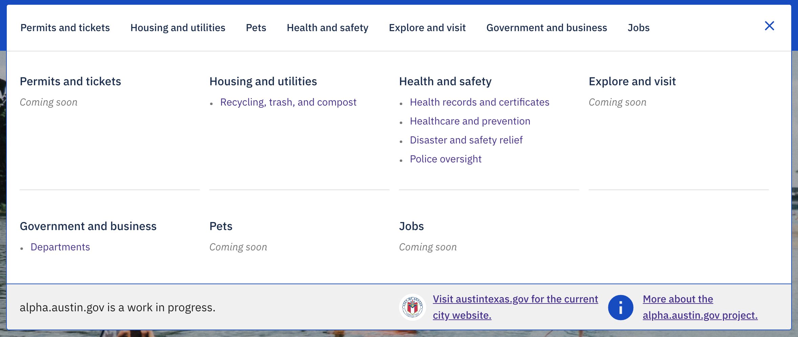
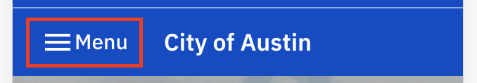
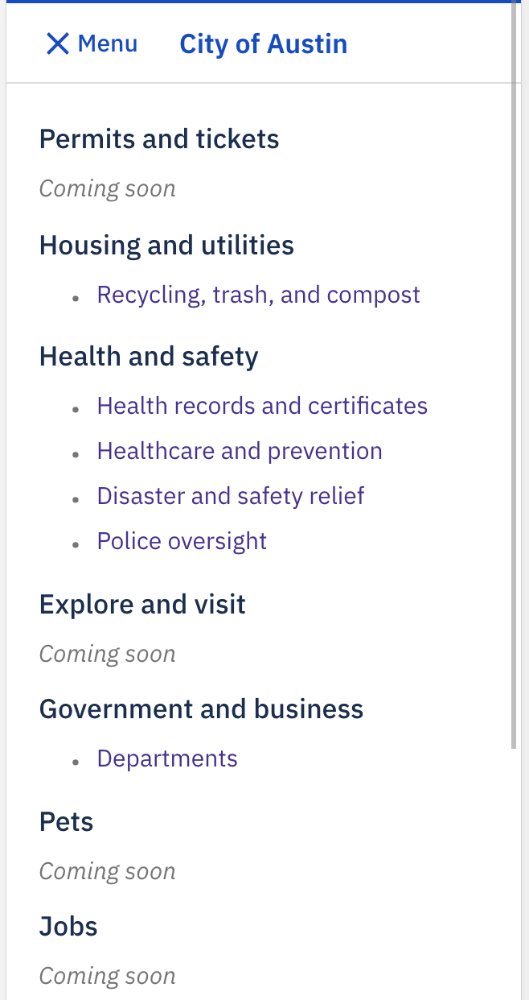

# Navigation menu

## Name:

### Navigation menu (WIP)

## Resident facing implementation (Desktop):

### Collapsed:

### Expanded:

## Resident facing implementation (Mobile):

### Collapsed:

### Expanded:

## Resident facing implementation (Code):

Janis (js) - [components/PageSections/Menu/FullSiteMenu.js](https://github.com/cityofaustin/janis/blob/master/src/components/PageSections/Menu/FullSiteMenu.js)

## Copy:

- Themes (TODO: put a link on it)
- Topic Collections (TODO: put a link on it)
