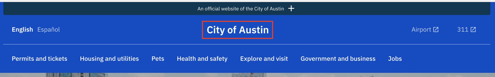
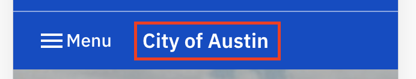

# Site title

## Name:

### Site title (WIP)

## Resident facing implementation (Desktop):

## Resident facing implementation (Mobile):

## Resident facing implementation (Code):

Janis (js) - [src/components/PageSections/Header/index.js](https://github.com/cityofaustin/janis/blob/ec7a30a7c066d59c325f8822db30e098f16e09a8/src/components/PageSections/Header/index.js#L183)

## Copy:

### In Janis:

- [src/components/PageSections/Header/index.js](https://github.com/cityofaustin/janis/blob/ec7a30a7c066d59c325f8822db30e098f16e09a8/src/components/PageSections/Header/index.js#L183) - Line hardcoded into component
