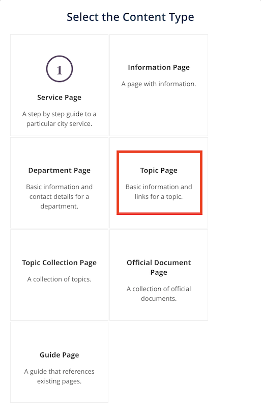
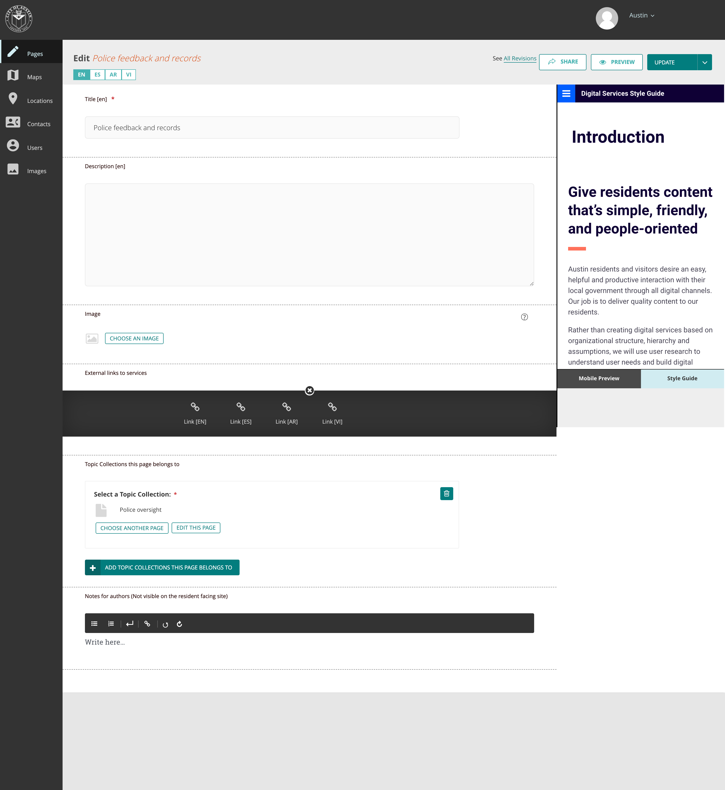

# Topics

## Name:

### Topics (WIP)

## Resident facing implementations:

### [Topic collection page topic blocks](topic_collection_page_topic_blocks.md)

### [URLs](urls.md)

### [Topic Page](topic_page.md)

## Copy:

### In Joplin:

#### Create content modal

#### Edit page

### In Joplin (code)

[models/topic_page.py](https://github.com/cityofaustin/joplin/blob/master/joplin/base/models/topic_page.py)
